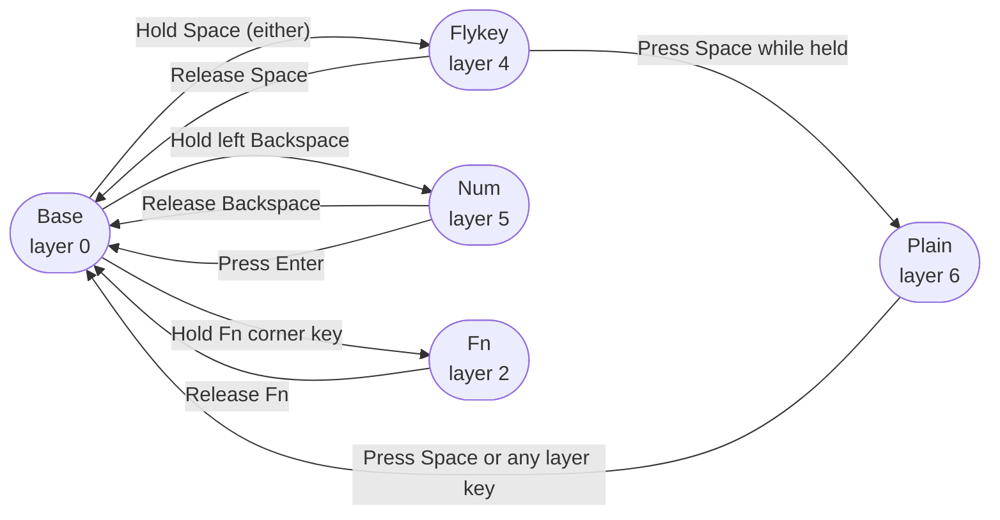

# Custom Keymap Guide

How to use the modified Kinesis Advantage 360 Pro firmware.

## What's Different

| Customization | How to use |
|---|---|
| **Flykey layer** | Hold either Space key — home-row navigation and editing |
| **Num layer** | Hold left Backspace — numpad on the right hand |
| **Plain layer** | Press Space while in Flykey — disables accidental layer-hops |
| **Home-row mods** | Hold any home-row key ≥200 ms to send a modifier |
| **Caps Lock → Esc** | Caps Lock sends Escape |
| **Q+W → Esc** | Simultaneous Q+W (within 50 ms) sends Escape |

---

## How Layers Switch



**Momentary layers** (Flykey, Num, Fn) are active only while you hold the key — release to return.
**Plain** is different: it *latches*. Hold Space → tap Space → release Space. You stay in Plain until you press Space or a layer key again.

---

## Base Layer

Diagrams use `key/MOD` for dual-role keys: tap the key for the letter, hold for the modifier.
Modifier abbreviations: `⌃` Control · `⌥` Option/Alt · `⌘` Command · `⇧` Shift

### Main Keys

```
 ←────────────── Left half ──────────────→   ←─────────────── Right half ──────────────→

  =    1    2    3    4    5   [Kp]          [Mo]   6    7    8    9    0    -
 Tab   Q    W    E    R    T                         Y    U    I    O    P    \
`/⌃  A/⌃  S/⌥  D/⌘  F/⇧   G                         H   J/⇧  K/⌘  L/⌥  ;/⌃  '/⌃
\/⇧   Z    X    C    V    B   Hom           PgU      N    M    ,    .    /   //⇧
```

`[Kp]` toggles the Keypad layer.  `[Mo]` holds the Mod layer (Bluetooth, RGB, etc.).
`Hom` / `PgU` are dedicated keys on row 4 center.

### Thumb Cluster

```
 Left thumb                        Right thumb
 ┌──────┬──────┐                   ┌──────┬──────┐
 │ [/⌥  │ ]/⌘  │  ← top row        │ -/⌘  │ =/⌥  │
 └──────┴──────┘                   └──────┴──────┘

 ┌────┬────┬─────┬───┬───┐         ┌─────┬────┬─────┐   ┌───┬───┬───┬───┬────┐
 │ Fn │ `  │ Esc │ ← │ → │         │PgDn │Ent │ End │   │ ↑ │ ↓ │ [ │ ] │ Fn │
 └────┴────┴─────┴───┴───┘         └─────┴────┴─────┘   └───┴───┴───┴───┴────┘
           ┌───────────┬──────────┐         ┌───────────┐
           │   Space   │ Backspace│         │   Space   │
           │ (Flykey)  │  (Num)   │         │ (Flykey)  │
           └───────────┴──────────┘         └───────────┘
```

Thumb Space keys: **tap** = Space, **hold** = Flykey layer.
Left Backspace: **tap** = Backspace, **hold** = Num layer.
`Fn` corner keys: **hold** = Fn layer.

---

## Flykey Layer — Hold Space

Hold either Space key to activate. The left hand handles text editing; the right hand handles cursor movement. Everything else passes through to the Base layer (home-row mods still work).

### Left Hand — Editing

```
  Q      W      E      R      T
 mv↑    ⌘⌫     ⌥⌫     ⌥⌦     ⌘⌦

  A      S      D      F      G
 mv↓    ^U      ⌫      ⌦     ^K

  Z      X      C      V      B
 Esc    ⌘↑     ⌘↓      ↵      ⇥
```

| Key | What it does |
|-----|-------------|
| Q | Move current line up (⌥↑ — works in VS Code / most editors) |
| W | Delete to start of line (⌘⌫) |
| E | Delete word to the left (⌥⌫) |
| R | Delete word to the right (⌥⌦) |
| T | Delete to end of line (⌘⌦) |
| A | Move current line down (⌥↓) |
| S | Kill to start of line, ^U (Emacs / Unix terminals) |
| D | Backspace |
| F | Forward delete |
| G | Kill to end of line, ^K (Emacs / Unix terminals) |
| Z | Escape |
| X | Jump to top of document (⌘↑) |
| C | Jump to bottom of document (⌘↓) |
| V | Return |
| B | Tab |
| **Space** | **Switch to Plain layer** |

### Right Hand — Navigation

```
  Y      U      I      O      P
 ⌘←     ⌥←     ↑      ⌥→    ⌘→

  H      J      K      L      ;
 ^A      ←      ↓      →     ^E

  N      M      ,      .
 Hom    PgU    PgD    End
```

| Key | What it does |
|-----|-------------|
| Y | Line start — ⌘← in GUI apps |
| U | Word left (⌥←) |
| I | Up |
| O | Word right (⌥→) |
| P | Line end — ⌘→ in GUI apps |
| H | Beginning of line — ^A (Emacs; also works in macOS text fields and terminal) |
| J | Left |
| K | Down |
| L | Right |
| ; | End of line — ^E (Emacs; also works in macOS text fields and terminal) |
| N | Home |
| M | Page up |
| , | Page down |
| . | End |

> **Line start/end:** Use `H`/`;` (^A/^E) in terminal and Emacs; use `Y`/`P` (⌘←/⌘→) in GUI apps like browsers and editors.

---

## Num Layer — Hold Left Backspace

Hold the left Backspace thumb key. The right hand becomes a numpad; the left hand passes through to Base.

```
 ←── Left: unchanged ────────────→   ←── Right: numpad ───────────────→

  ·    ·    ·    ·    ·    ·    ·     ·    +    7    8    9    *    ·
  ·    ·    ·    ·    ·    ·    ·     ·    0    4    5    6    =    ·
  ·    ·    ·    ·    ·    ·    ·     ·    -    1    2    3    /    ·
```

```
Thumb:  [ Enter → Base ]  [ Space = 0 ]
```

- `+` is under the Y key (left column of right hand, row 2)
- `0` is under H (left column of right hand, row 3) — also on right thumb Space
- `-` is under N (left column of right hand, row 4)
- Press **Enter** to leave the Num layer and return to Base

---

## Plain Layer — Tap Space while in Flykey

**Problem it solves:** When typing fast, holding Space briefly while reaching for the next key can accidentally trigger the Flykey layer, sending navigation commands instead of characters.

**How to enter:** While holding Space (Flykey active), tap Space again, then release.
**What changes:** The Space thumb keys send plain Space (no layer-hop). All hold-tap behaviours on the outer-column keys and thumb cluster are disabled.
**Letter keys are unchanged** — home-row mods still work.
**How to leave:** Press Space or any layer key.

---

## Quick Reference

### Flykey shortcuts by category

**Cursor movement**

| Flykey key | Action | Shortcut |
|---|---|---|
| J | Left | ← |
| K | Down | ↓ |
| I | Up | ↑ |
| L | Right | → |
| U | Word left | ⌥← |
| O | Word right | ⌥→ |
| Y | Line start (GUI) | ⌘← |
| P | Line end (GUI) | ⌘→ |
| H | Line start (terminal) | ^A |
| ; | Line end (terminal) | ^E |
| N | Home | Home |
| . | End | End |
| M | Page up | PgUp |
| , | Page down | PgDn |
| X | Document top | ⌘↑ |
| C | Document bottom | ⌘↓ |

**Deletion**

| Flykey key | Action | Shortcut |
|---|---|---|
| D | Backspace | ⌫ |
| F | Delete | ⌦ |
| E | Delete word left | ⌥⌫ |
| R | Delete word right | ⌥⌦ |
| W | Delete to line start | ⌘⌫ |
| T | Delete to line end | ⌘⌦ |
| S | Kill to line start | ^U |
| G | Kill to line end | ^K |

**Other**

| Flykey key | Action |
|---|---|
| Z | Escape |
| V | Return |
| B | Tab |
| Q | Move line up |
| A | Move line down |
| Space | Enter Plain layer |
