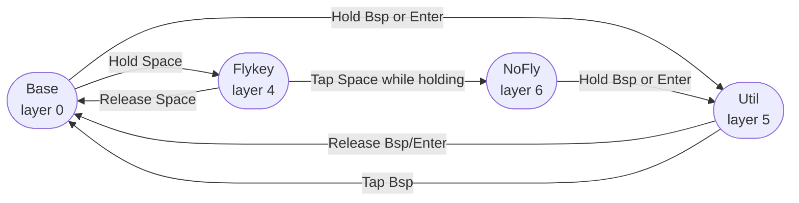

# Custom Keymap Guide

How to use the modified Kinesis Advantage 360 Pro firmware.

## What's Different

| Customization | How to use |
|---|---|
| **Flykey layer** | Hold either Space key — home-row navigation and editing |
| **Util layer** | Hold left Backspace or Enter — numpad + pure mods + edit shortcuts |
| **NoFly layer** | Tap Space while in Flykey — Space no longer activates Flykey; exit by holding Backspace then tapping it |
| **Home-row mods** | Hold A/S/D/F (left) or J/K/L/; (right) in Base for ⌃/⌥/⌘/⇧ |
| **Caps Lock → Esc** | Caps Lock sends Escape |
| **Q+W → Esc** | Simultaneous Q+W sends Escape |

Home-row mods are a Base layer feature and continue to work in NoFly.

---

## How Layers Switch



**Momentary layers** (Flykey, Util) are active only while you hold the activation key.
**NoFly** latches on: hold Space → tap Space → release. It stays active until you exit.
**Exiting NoFly**: hold Backspace (Util activates on top of NoFly) → tap Backspace (`&to 0` fires) → release. The Util layer acts as a bridge back to Base.

---

## Base Layer

`key/MOD` = tap for the key, hold for the modifier.
Abbreviations: `⌃` Control · `⌥` Option · `⌘` Command · `⇧` Shift

```
    =    1    2    3    4    5                            6    7    8    9    0    -
  Tab    Q    W    E    R    T                            Y    U    I    O    P    \
  `/⌃  A/⌃  S/⌥  D/⌘  F/⇧    G                            H  J/⇧  K/⌘  L/⌥  ;/⌃  '/⌃
  \/⇧    Z    X    C    V    B                            N    M    ,    .    /  //⇧
   Fn    `  Esc    ←    →                                 ↑    ↓    [    ]       Fn

                                ┌─────┬─────┐   ┌─────┬─────┐
                                │ [/⌥ │ ]/⌘ │   │ -/⌘ │ =/⌥ │
                          ┌─────┼─────┼─────┤   ├─────┼─────┼─────┐
                          │ Spc │ Bsp │     │   │     │ Ent │ Spc │
                          │/Fly │/Util│ Hom │   │ PgU │/Util│/Fly │
                          │     │     ├─────┤   ├─────┤     │     │
                          │     │     │ End │   │ PgD │     │     │
                          └─────┴─────┴─────┘   └─────┴─────┴─────┘
```

- Thumb **Space** (either): tap = Space, hold = Flykey layer
- Thumb **Backspace**: tap = Backspace, hold = Util layer
- Thumb **Enter**: tap = Enter, hold = Util layer
- Thumb top row **[/⌥ ]/⌘** and **-/⌘ =/⌥**: tap = bracket/symbol, hold = modifier
- **Fn** (corner keys): hold = Fn layer · **[Kp]** key: toggle Keypad layer

### Thumb Cluster Layout

Each thumb cluster is a 3×3 grid with one corner removed. The two inner keys are tall (span two rows). The right cluster mirrors the left.

---

## Flykey Layer — Hold Space

Hold either Space key. Left hand handles text editing; right hand handles cursor movement.
`·` = same as Base (home-row mods still work).

```
    ·    ·    ·    ·    ·    ·                            ·    ·    ·    ·    ·    ·
    ·  mv↑   ⌘⌫   ⌥⌫   ⌥⌦   ⌘⌦                          ⌘←   ⌥←    ↑   ⌥→   ⌘→    ·
    ·  mv↓   ^U    ⌫    ⌦   ^K                           ^A    ←    ↓    →   ^E    ·
    ·  Esc   ⌘↑   ⌘↓    ↵    ⇥                           Hm  PgU  PgD  End    ·    ·
    ·    ·    ·    ·    ·                                 ·    ·    ·    ·         ·

                                ┌─────┬─────┐   ┌─────┬─────┐
                                │  ·  │  ·  │   │  ·  │  ·  │
                          ┌─────┼─────┼─────┤   ├─────┼─────┼─────┐
                          │ →NF │     │     │   │     │     │ →NF │
                          │     │  ·  │  ·  │   │  ·  │  ·  │     │
                          │     │     ├─────┤   ├─────┤     │     │
                          │     │     │  ·  │   │  ·  │     │     │
                          └─────┴─────┴─────┘   └─────┴─────┴─────┘
```

→NF = tapping Space while held switches to NoFly layer.

### Key Reference

| L-Key | Editing action | R-Key | Navigation action |
|---|---|---|---|
| D | Backspace ⌫ | J | Left ← |
| F | Delete ⌦ | K | Down ↓ |
| E | Delete word left ⌥⌫ | I | Up ↑ |
| R | Delete word right ⌥⌦ | L | Right → |
| W | Delete to line start ⌘⌫ | H | Line start ^A |
| T | Delete to line end ⌘⌦ | ; | Line end ^E |
| S | Kill to line start ^U | Y | Line start ⌘← |
| G | Kill to line end ^K | P | Line end ⌘→ |
| A | Move line down ⌥↓ | U | Word left ⌥← |
| Q | Move line up ⌥↑ | O | Word right ⌥→ |
| Z | Escape | N | Home |
| V | Return ↵ | M | Page up |
| B | Tab ⇥ | , | Page down |
| X | Doc top ⌘↑ | . | End |
| C | Doc bottom ⌘↓ | | |

> **Line start/end:** H/; (^A/^E) work in terminal, Emacs, and macOS native text fields.
> Y/P (⌘←/⌘→) work in GUI apps like browsers and text editors.

---

## Util Layer — Hold Left Backspace or Enter

Right hand becomes a numpad. Left hand provides pure modifier keys (no letter output) and common edit shortcuts.

```
    ·    ·    ·    ·    ·    ·                            ·    ·    ·    ·    ·    ·
    ·    ·    ·    ·    ·    ·                            +    7    8    9    *    ·
    ·    ⌃    ⌥    ⌘    ⇧  Spc                            0    4    5    6    =    ·
    ·  Und  Cut  Cpy  Pst  Rdo                            -    1    2    3    /    ·
    ·    ·    ·    ·    ·                                 ·    ·    ·    ·         ·

                                ┌─────┬─────┐   ┌─────┬─────┐
                                │  ·  │  ·  │   │  ·  │  ·  │
                          ┌─────┼─────┼─────┤   ├─────┼─────┼─────┐
                          │ →NF │→Bas │     │   │     │     │ →NF │
                          │     │  e  │  ·  │   │  ·  │  ·  │     │
                          │     │     ├─────┤   ├─────┤     │     │
                          │     │     │  ·  │   │  ·  │     │     │
                          └─────┴─────┴─────┘   └─────┴─────┴─────┘
```

- Left **Backspace** (while in Util): `&to 0` — returns to Base even from NoFly context
- Left **Space** / Right **Space**: switch to NoFly layer

### Key Reference

| L-Key | Action | R-Key | Value |
|---|---|---|---|
| | | Y | + |
| | | U | 7 |
| | | I | 8 |
| | | O | 9 |
| | | P | * |
| A | ⌃ Control | H | 0 |
| S | ⌥ Option | J | 4 |
| D | ⌘ Command | K | 5 |
| F | ⇧ Shift | L | 6 |
| G | Space | ; | = |
| Z | Undo ⌘Z | N | − |
| X | Cut ⌘X | M | 1 |
| C | Copy ⌘C | , | 2 |
| V | Paste ⌘V | . | 3 |
| B | Redo ⌘⇧Z | / | / |

**Using left-hand mods for tap-modifier patterns:** In Util, A/S/D/F send the modifier key alone — useful for apps that respond to a bare tap of ⌘ or ⌥ without a following character.

---

## NoFly Layer — Tap Space while in Flykey

**Problem it solves:** Fast typing sometimes briefly activates Flykey when the next key is pressed before Space is fully released, sending a navigation command instead of a character.

**How to enter:** While holding Space (Flykey active), tap Space again, then release both.

```
    ·    ·    ·    ·    ·    ·                            ·    ·    ·    ·    ·    ·
    ·    ·    ·    ·    ·    ·                            ·    ·    ·    ·    ·    ·
    ⌃  A/⌃  S/⌥  D/⌘  F/⇧    ·                            ·  J/⇧  K/⌘  L/⌥  ;/⌃    '
    ⇧    ·    ·    ·    ·    ·                            ·    ·    ·    ·    ·    ⇧
    ·    ·    ·    ·    ·                                 ·    ·    ·    ·         ·

                                ┌─────┬─────┐   ┌─────┬─────┐
                                │  ⌥  │  ⌘  │   │  ⌥  │  ⌘  │
                          ┌─────┼─────┼─────┤   ├─────┼─────┼─────┐
                          │ Spc │     │     │   │     │     │ Spc │
                          │     │  ·  │  ·  │   │  ·  │  ·  │     │
                          │     │     ├─────┤   ├─────┤     │     │
                          │     │     │  ·  │   │  ·  │     │     │
                          └─────┴─────┴─────┘   └─────┴─────┴─────┘
```

**Key differences from Base:**
- **Space** keys: plain Space — no Flykey activation.
- **Home-row mods** A/S/D/F/J/K/L/;: unchanged — still dual-role tap/hold.
- **Outer columns**: tap/hold dual-role removed; keys send only their modifier or character directly (e.g., outer-left sends ⌃ on any press, not tap-`/hold-⌃).
- **Thumb top row** [/⌥ ]/⌘ etc.: similarly send the modifier directly.
- **Outer shift column** (\/⇧ and //⇧): send ⇧ directly.

**How to exit:** Hold Backspace (Util activates momentarily) → tap Backspace while holding → release. The `&to 0` in Util restores Base. Enter works the same way as Backspace for the initial hold.
