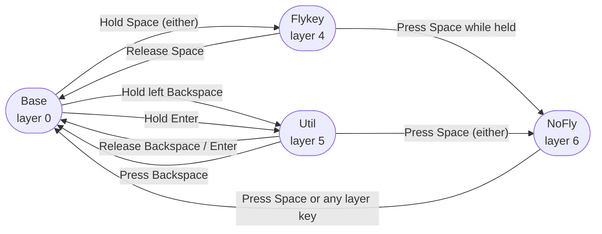

# Custom Keymap Guide

How to use the modified Kinesis Advantage 360 Pro firmware.

## What's Different

| Customization | How to use |
|---|---|
| **Flykey layer** | Hold either Space key — home-row navigation and editing |
| **Util layer** | Hold left Backspace or Enter — numpad + mods + edit shortcuts |
| **NoFly layer** | Press Space while in Flykey — disables accidental layer-hops |
| **Home-row mods** | Hold any home-row key ≥200 ms to send a modifier |
| **Caps Lock → Esc** | Caps Lock sends Escape |
| **Q+W → Esc** | Simultaneous Q+W (within 50 ms) sends Escape |

---

## How Layers Switch



**Momentary layers** (Flykey, Util) are active only while you hold the key — release to return.
**NoFly** is a latching layer: hold Space → tap Space → release Space. You stay in NoFly until you press Space or a layer key.

---

## Base Layer

`key/MOD` = tap for the key, hold ≥200 ms for the modifier.
Abbreviations: `⌃` Control · `⌥` Option · `⌘` Command · `⇧` Shift

```
 ←────────────── Left half ──────────────→   ←─────────────── Right half ──────────────→

  =    1    2    3    4    5   [Kp]          [Mo]   6    7    8    9    0    -
 Tab   Q    W    E    R    T                         Y    U    I    O    P    \
`/⌃  A/⌃  S/⌥  D/⌘  F/⇧   G   [/⌥  ]/⌘    -/⌘  =/⌥   H   J/⇧  K/⌘  L/⌥  ;/⌃  '/⌃
\/⇧   Z    X    C    V    B   Hom           PgU      N    M    ,    .    /   //⇧
  Fn   `   Esc   ←    →                                   ↑    ↓    [    ]    Fn
```

```
                    ┌────────────┬────────────┐         ┌────────────┬────────────┐
                    │  Spc/Fly   │  Bsp/Util  │  End    │  Ent/Util  │  Spc/Fly   │
                    └────────────┴────────────┘  PgDn   └────────────┴────────────┘
```

Thumb Space (either): **tap** = Space, **hold** = Flykey layer.
Left Backspace: **tap** = Backspace, **hold** = Util layer.
Enter: **tap** = Enter, **hold** = Util layer.
`[Kp]` toggles Keypad layer. `[Mo]` holds Mod layer (Bluetooth, RGB, etc.).
`Fn` corner keys: hold = Fn layer.

---

## Flykey Layer — Hold Space

Hold either Space key. Left hand handles text editing; right hand handles cursor movement.
`·` = passes through to Base (home-row mods still work).

```
 ←────────────── Left half ──────────────→   ←─────────────── Right half ──────────────→

  ·    ·    ·    ·    ·    ·    ·             ·      ·    ·    ·    ·    ·    ·
  ·   mv↑  ⌘⌫   ⌥⌫   ⌥⌦  ⌘⌦   ·                     ·   ⌘←   ⌥←   ↑    ⌥→  ⌘→   ·
  ·   mv↓  ^U   ⌫    ⌦   ^K    ·    ·         ·    ·   ·   ^A   ←    ↓    →   ^E   ·
  ·   Esc  ⌘↑   ⌘↓   ↵    ⇥    ·              ·      ·   Hm  PgU  PgD  End   ·    ·
  ·    ·    ·    ·    ·                                   ·    ·    ·    ·    ·
```

```
                    ┌────────────┬────────────┐         ┌────────────┬────────────┐
                    │  →NoFly    │      ·      │   ·    │      ·      │  →NoFly    │
                    └────────────┴────────────┘    ·   └────────────┴────────────┘
```

### Key Reference

| L-Key | Editing action | R-Key | Navigation action |
|---|---|---|---|
| D | Backspace ⌫ | J | Left ← |
| F | Delete ⌦ | K | Down ↓ |
| E | Delete word left ⌥⌫ | I | Up ↑ |
| R | Delete word right ⌥⌦ | L | Right → |
| W | Delete to line start ⌘⌫ | H | Line start ^A |
| T | Delete to line end ⌘⌦ | ; | Line end ^E |
| S | Kill to line start ^U | Y | Line start ⌘← |
| G | Kill to line end ^K | P | Line end ⌘→ |
| A | Move line down ⌥↓ | U | Word left ⌥← |
| Q | Move line up ⌥↑ | O | Word right ⌥→ |
| Z | Escape | N | Home |
| V | Return ↵ | M | Page up |
| B | Tab ⇥ | , | Page down |
| X | Doc top ⌘↑ | . | End |
| C | Doc bottom ⌘↓ | | |

> **Line start/end:** Use `H`/`;` (^A/^E) in terminal and Emacs — these also work in macOS native text fields.
> Use `Y`/`P` (⌘←/⌘→) in GUI apps like browsers and editors.

---

## Util Layer — Hold Left Backspace or Enter

Right hand becomes a numpad. Left hand provides pure modifier keys (no letter output, no tap delay) and common edit shortcuts.

```
 ←────────────── Left half ──────────────→   ←─────────────── Right half ──────────────→

  ·    ·    ·    ·    ·    ·    ·             ·      ·    +    7    8    9    *    ·
  ·    ·    ·    ·    ·    ·    ·                     ·    0    4    5    6    =    ·
  ·    ⌃    ⌥    ⌘    ⇧   Spc   ·    ·         ·    ·   ·    -    1    2    3    /    ·
  ·   Und  Cut  Cpy  Pst  Rdo   ·              ·      ·    ·    ·    ·    ·    ·    ·
  ·    ·    ·    ·    ·                                   ·    ·    ·    ·    ·
```

```
                    ┌────────────┬────────────┐         ┌────────────┬────────────┐
                    │  →NoFly    │  →Base      │   ·    │      ·      │  →NoFly    │
                    └────────────┴────────────┘    ·   └────────────┴────────────┘
```

### Key Reference

| L-Key | Action | R-Key | Value |
|---|---|---|---|
| | | Y | + |
| | | U | 7 |
| | | I | 8 |
| | | O | 9 |
| | | P | * |
| A | ⌃ Control | H | 0 |
| S | ⌥ Option | J | 4 |
| D | ⌘ Command | K | 5 |
| F | ⇧ Shift | L | 6 |
| G | Space | ; | = |
| Z | Undo ⌘Z | N | − |
| X | Cut ⌘X | M | 1 |
| C | Copy ⌘C | , | 2 |
| V | Paste ⌘V | . | 3 |
| B | Redo ⌘⇧Z | / | / |

**Thumb while in Util:**
- Left Space / Right Space → NoFly layer
- Backspace → back to Base (`&to 0`, exits even without releasing hold key)

**Using Util for tap-modifier patterns:** Activate Util (hold Bsp or Enter), then tap A/S/D/F to send a bare modifier keydown. Useful for apps that need tap-⌘ or tap-⌥ without a following character.

---

## NoFly Layer — Tap Space while in Flykey

**Problem it solves:** Fast typing sometimes briefly activates Flykey when reaching for the next key while Space is still down, sending a navigation command instead of a space.

**How to enter:** While holding Space (Flykey active), tap and release Space. Flykey deactivates; NoFly latches on.

```
 ←────────────── Left half ──────────────→   ←─────────────── Right half ──────────────→

  ·    ·    ·    ·    ·    ·    ·             ·      ·    ·    ·    ·    ·    ·
  ·    ·    ·    ·    ·    ·                          ·    ·    ·    ·    ·    ·
  ·   A/⌃  S/⌥  D/⌘  F/⇧   ·    ·    ·         ·    ·   ·   J/⇧  K/⌘  L/⌥  ;/⌃   ·
  ·    ·    ·    ·    ·    ·    ·              ·      ·    ·    ·    ·    ·    ·
  ·    ·    ·    ·    ·                                   ·    ·    ·    ·    ·
```

```
                    ┌────────────┬────────────┐         ┌────────────┬────────────┐
                    │   Space    │      ·      │   ·    │      ·      │   Space    │
                    └────────────┴────────────┘    ·   └────────────┴────────────┘
```

**Key differences from Base:**
- Space keys send plain Space — **no Flykey activation**.
- Home-row mods (A/S/D/F/J/K/L/;) work unchanged.
- Outer columns (outer-left `` `/⌃ ``, outer-right `'/⌃`, `` \/⇧ ``, `` //⇧ ``) pass through to Base.

**How to leave:** Press either Space or any layer key (Fn, Kp, etc.).
